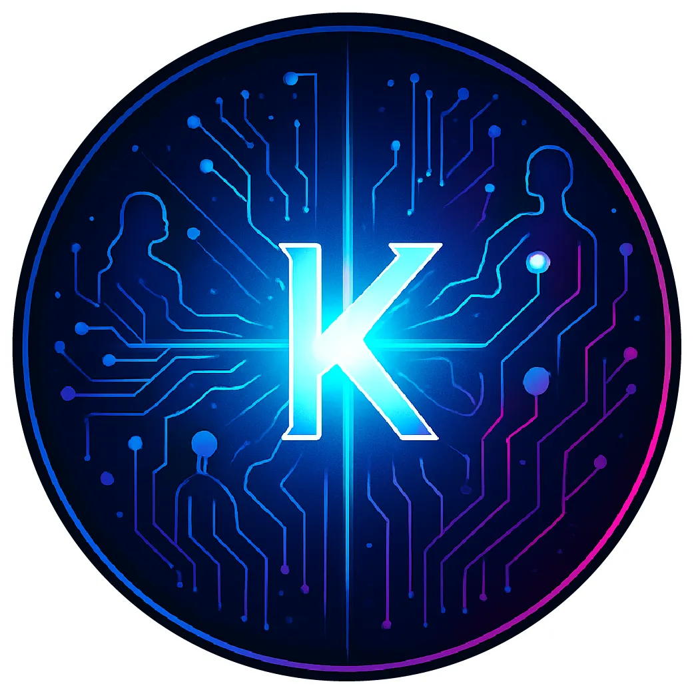

# English
# 🚀 Nova.K AI Agent Starter Kit

Welcome to the Nova.K AI Agent and Automation Starter Kit! This project provides everything you need to start building powerful AI agents and workflow automations for various ideas and scenarios, regardless of your technical background.



## :key: Key Features

- **Low-code Development**: Create agents without writing code using n8n's visual workflow editor - if not using CodeGPT Agents
- **Local LLM Processing**: Run AI models locally for privacy and cost savings - Ollama, Deepseek, etc.
- **Vector Search**: Implement semantic search and RAG patterns with Qdrant
- **Extensible Architecture**: Add new capabilities through n8n nodes and integrations, like Google Drive, Sheets, Docs, Notion, Slack, and other APIs
- **Comprehensive Examples**: Learn from working examples covering common use cases

## 📋 Overview

This starter kit provides a complete environment for developing integrations with AI agents and workflows using:

- **n8n**: Low-code workflow automation platform with 400+ integrations and AI components
- **Ollama/deepseek**: Run powerful LLMs locally on your machine
- **Open WebUI**: ChatGPT-like interface for interacting with your local models
- **Qdrant**: Vector database for semantic search and retrieval
- **PostgreSQL**: Reliable database for storing structured data

All components are pre-configured and ready to use through Docker, making setup easy regardless of your technical expertise.

## 🔧 Prerequisites

- **RAM**: 8GB+ RAM is recommended, especially for running Large Language Models (LLMs) locally. More RAM (16GB+) will provide a better experience.

That's it! Our automated setup script will install all other dependencies for you.

## 🚀 Quick Start

### 1. Clone this repository

Open your terminal, copy and paste the following commands.

```bash
git clone https://github.com/konfio/nova-k-starter-kit.git
cd nova-k-starter-kit
```

### 2. Run the setup script

#### On macOS

```bash
# Open Terminal and run:
./scripts/setup.sh
```

#### On Windows

```bash
# Open PowerShell and run:
bash ./scripts/setup.sh
```

The setup script will automatically install all required dependencies (Git, Docker, mise, Task) and configure your environment.

### 3. Start the services

```bash
task start
```

### 4. Access the services

Once all services are running, you can access them at:

- **n8n**: [http://localhost:5678](http://localhost:5678)
- **Open WebUI**: [http://localhost:3000](http://localhost:3000)
- **Qdrant Dashboard**: [http://localhost:6333/dashboard](http://localhost:6333/dashboard)

### 4. Set up your first agent

Follow our [First Agent Tutorial](docs/first-agent.md) to create your first AI agent in minutes!

## 📚 What's Included

- **Pre-configured Docker environment** with all necessary services
- **Example workflows** for common AI agent scenarios
- **Step-by-step tutorials** for building different types of agents
- **Integration templates** for connecting to various data sources
- **Best practices** for AI agent development

## 🗂️ Project Structure

```bash
nova-k-starter-kit/
├── docker-compose.yml       # Docker configuration for all services
├── Taskfile.yml             # Task automation for common operations
├── .env.example             # Example environment variables
├── services/                # Service-specific configurations
│   ├── n8n/                 # n8n configuration and workflows
│   ├── ollama/              # Ollama models and configuration
│   ├── openwebui/           # Open WebUI configuration
│   └── qdrant/              # Qdrant vector database configuration
├── examples/                # Example workflows and agents
│   ├── customer-support/    # Customer support agent example
│   ├── data-analysis/       # Data analysis agent example
│   └── document-qa/         # Document Q&A agent example
└── docs/                    # Documentation
    ├── images/              # Images for documentation
    ├── first-agent.md       # Getting started tutorial
    ├── concepts.md          # Key concepts explanation
    └── advanced-usage.md    # Advanced usage guides
```

## 🧩 Example Agents

This starter kit includes several example agents to help you get started:

1. **Customer Support Agent**: Answers customer queries using your knowledge base
2. **Data Analysis Agent**: Analyzes data from various sources and generates insights
3. **Document Q&A Agent**: Answers questions based on document content

Check the [examples directory](examples/) for more details on each example.

## 📖 Documentation

- [First Agent Tutorial](docs/first-agent.md): Step-by-step guide to creating your first agent
- [Key Concepts](docs/concepts.md): Understanding the core concepts of AI agents
- [Advanced Usage](docs/advanced-usage.md): Taking your agents to the next level

## :speech_balloon: Integrating Open Web UI with your n8n Workflow and/or agent
- Copy this Python file code [n8n.py](n8n.py)
- Go to your profile (must be admin) in Open Web UI [http://localhost:3000](http://localhost:3000)
- Click on Settings
- Go to Admin Settings
- On top menu, click on Functions
- Click on "+" at the top right to add new Function
- Provide a name and description for the Function
- Replace all code, with the Python code you copied from [n8n.py](n8n.py)
- Replace the line of the code with your N8N webhook name to your production URL from n8n workflow
  ```python
    default="http://host.docker.internal:5678/webhook/{your N8N webhook name}"
  ```
  ```python
    i.e. default="http://host.docker.internal:5678/webhook/incoming_request_for_my_agent_and_workflow"
  ```
- Replace the temporary request message for your agent name
 ```python
  -> Optional[dict]:
        await self.emit_status(
            __event_emitter__,
            "info",
            "/Calling N8N Workflow for {Your CodeGPT Agent Name}...",
            False,
        )
```
```python
  -> Optional[dict]:
        await self.emit_status(
            __event_emitter__,
            "info",
            "/Calling N8N Workflow for My Agent Name...",
            False,
        )
```
- Click Save at the bottom right
- On the top right, click on enable function dial to activate model in Open Web UI
- Now you can start a new chat, and select in the top left the Model

## :link: Sharing your localhost environment with other members
- Only if really required, you may use https://localxpose.io/, which allows you to create up to 2 tunnels, which would only be relevant for n8n and Open Web UI.
- Open a free account, follow the instructions to activate your key, by following instructions at https://localxpose.io/docs
- Make sure you point to the right paths for Open Web UI
```bash
      loclx tunnel http --to localhost:3000
```
- And from another terminal for n8n
```bash
      loclx tunnel http --to localhost:5678
```
- Expand terminal window and copy the hashed xxxxxxxxxx.loclx.io url to share
- Tunnels will expire after 6 hours, so you might need to close tunnels and run it again

## 🛠️ Troubleshooting

Having issues? Check our [Troubleshooting Guide](docs/troubleshooting.md) or open an issue on this repository.

For support and queries, use the #nova_k25_hachathon Slack channel.

## 🤝 Contributing

Contributions are welcome! Please feel free to submit a Pull Request.

## 📄 License

This project is licensed under the MIT License - see the [LICENSE](LICENSE) file for details.

---

# Español
# 🚀 Kit de Inicio para Agentes de IA Nova.K

¡Bienvenid@ al Kit de Inicio para Agentes de IA y Automatización de Nova.K! Este proyecto te proporciona todo lo necesario para comenzar a construir potentes agentes de inteligencia artificial y automatizaciones de flujo de trabajo para diferentes ideas y escenarios, sin importar tu nivel técnico.


##:key: Características Principales

**Desarrollo Low-code**: Crea agentes sin escribir código usando el editor visual de flujos de trabajo de n8n — si no usas agentes con CodeGPT.
**Procesamiento Local de LLMs**: Ejecuta modelos de IA localmente para mayor privacidad y ahorro de costos — como con Ollama o Deepseek.
**Búsqueda Vectorial**: Implementa búsqueda semántica y patrones RAG con Qdrant.
**Arquitectura Extensible**: Agrega nuevas capacidades a través de nodos e integraciones de n8n como Google Drive, Sheets, Docs, Notion, Slack y muchas otras APIs.
**Ejemplos Completos**: Aprende con ejemplos funcionales que cubren casos de uso comunes.

## 📋 Descripción General

Este kit de inicio proporciona un entorno completo para desarrollar integraciones con agentes de IA y flujos de trabajo usando:

- **n8n**: Plataforma de automatización low-code con más de 400 integraciones y componentes de IA.
- **Ollama/Deepseek**: Ejecuta modelos LLM potentes localmente en tu máquina.
- **Open WebUI**: Interfaz estilo ChatGPT para interactuar con tus modelos locales.
- **Qdrant**: Base de datos vectorial para búsqueda semántica y recuperación de información.
- **PostgreSQL**: Base de datos confiable para almacenar datos estructurados.

Todos los componentes ya vienen preconfigurados y listos para usarse a través de Docker, facilitando la instalación sin importar tu experiencia técnica.

## 🔧 Requisitos Previos

- **Docker** (o un runtime de contenedores compatible):
  - **Docker Desktop**: Recomendado para la mayoría en Windows, macOS y Linux.
    - Instalación: [Descargar Docker Desktop](https://www.docker.com/products/docker-desktop/)
    - Docker Compose usualmente ya viene incluido.
  - **Alternativas**:
    - **Podman**: Motor de contenedores sin demonio.
      - Instalación: [Guía de instalación de Podman](https://podman.io/docs/installation)
      - También necesitarás `podman-compose`.
    - **OrbStack**: Forma rápida y ligera de correr contenedores Docker y máquinas Linux en macOS.
      - Instalación: [Sitio web de OrbStack](https://orbstack.dev/)
- **Git**: Para clonar este repositorio.
  - Instalación: [Descargar Git](https://git-scm.com/downloads)
- **Memoria RAM**: Se recomienda al menos 8GB, especialmente si vas a correr LLMs localmente. Con 16GB o más tendrás una mejor experiencia. O bien, usa CodeGPT para ello.

## 🚀 Inicio Rápido

### 1. Clona este repositorio

Abre tu terminal y copia/pega los siguientes comandos:

```bash
git clone https://github.com/konfio/nova-k-starter-kit.git
cd nova-k-starter-kit
```

### 2. Inicia los servicios

Usando Task (recomendado):

```bash
task start
```

### 3. Accede a los servicios

Una vez que todos los servicios estén corriendo, podrás acceder a:

- **n8n**: [http://localhost:5678](http://localhost:5678)
- **Open WebUI**: [http://localhost:3000](http://localhost:3000)
- **Dashboard de Qdrant**: [http://localhost:6333/dashboard](http://localhost:6333/dashboard)

### 4. Crea tu primer agente

Sigue nuestro [Tutorial del Primer Agente](docs/first-agent.md) para tener tu primer agente de IA en minutos.

## 📚 ¿Qué Incluye?

- **Entorno Docker preconfigurado** con todos los servicios necesarios
- **Flujos de trabajo de ejemplo** para escenarios comunes con agentes de IA
- **Tutoriales paso a paso** para construir distintos tipos de agentes
- **Plantillas de integración** para conectar con distintas fuentes de datos
- **Mejores prácticas** para el desarrollo de agentes de IA

## 🗂️ Estructura del Proyecto

```bash
nova-k-starter-kit/
├── docker-compose.yml       # Configuración de Docker para todos los servicios
├── Taskfile.yml             # Automatización de tareas comunes
├── .env.example             # Variables de entorno de ejemplo
├── services/                # Configuraciones específicas por servicio
│   ├── n8n/                 # Configuración y flujos de trabajo de n8n
│   ├── ollama/              # Modelos y configuración de Ollama
│   ├── openwebui/           # Configuración de Open WebUI
│   └── qdrant/              # Configuración de la base de datos vectorial Qdrant
├── examples/                # Ejemplos de flujos de trabajo y agentes
│   ├── customer-support/    # Ejemplo de agente de soporte al cliente
│   ├── data-analysis/       # Ejemplo de agente de análisis de datos
│   └── document-qa/         # Ejemplo de agente para preguntas sobre documentos
└── docs/                    # Documentación
    ├── images/              # Imágenes para la documentación
    ├── first-agent.md       # Tutorial de inicio
    ├── concepts.md          # Explicación de conceptos clave
    └── advanced-usage.md    # Guías de uso avanzado
```

## 🧩 Agentes de Ejemplo

Este kit incluye varios agentes de ejemplo para ayudarte a empezar:

1. **Agente de Soporte al Cliente**: Responde preguntas usando tu base de conocimiento.
2. **Agente de Análisis de Datos**: Analiza datos de distintas fuentes y genera insights.
3. **Agente de Q&A de Documentos**: Responde preguntas basadas en contenido documental.

Consulta el [directorio de ejemplos](examples/) para más detalles sobre cada uno.

## 📖 Documentación

- [Tutorial del Primer Agente](docs/first-agent.md): Guía paso a paso para crear tu primer agente
- [Conceptos Clave](docs/concepts.md): Entiende los fundamentos de los agentes de IA
- [Uso Avanzado](docs/advanced-usage.md): Lleva tus agentes al siguiente nivel

Aquí tienes la traducción al español, manteniendo el formato Markdown:

## :link: Compartiendo tu entorno de localhost con otros miembros

- Solo si es realmente necesario, puedes usar [https://localxpose.io/](https://localxpose.io/), que te permite crear hasta 2 túneles, lo cual sería útil únicamente para n8n y Open Web UI.
- Abre una cuenta gratuita y sigue las instrucciones para activar tu clave en [https://localxpose.io/docs](https://localxpose.io/docs)
- Asegúrate de apuntar a las rutas correctas para Open Web UI:

```bash
      loclx tunnel http --to localhost:3000
```
 -	Y desde otra terminal para n8n:
```bash
      loclx tunnel http --to localhost:5678
```
- Expande la ventana de la terminal y copia la URL con hash del tipo xxxxxxxxxx.loclx.io para compartirla
- Los túneles expirarán después de 6 horas, por lo que puede que necesites cerrarlos y ejecutarlos nuevamente

¿Te gustaría que lo integre directamente a tu archivo `README_es_MX.md`?

## 🛠️ Resolución de Problemas

¿Tienes problemas? Consulta nuestra [Guía de Solución de Problemas](docs/troubleshooting.md) o abre un *issue* en este repositorio.

Para soporte y dudas, usa el canal de Slack `#nova_k25_hachathon`.

## 🤝 Contribuciones

¡Contribuciones son bienvenidas! No dudes en enviar un Pull Request.

## 📄 Licencia

Este proyecto está bajo la Licencia MIT — consulta el archivo [LICENSE](LICENSE) para más detalles.
